# mvp-acidentes-setor-eletrico

MVP de Engenharia de Dados para análise de acidentes e ocorrências de segurança no setor elétrico, utilizando Databricks e tabelas Delta.

## 1. Contexto do Negócio

O setor elétrico envolve atividades com elevado potencial de risco, tornando a prevenção de acidentes um aspecto essencial da gestão de segurança. Nesse contexto, a análise de registros de acidentes, quase-acidentes e desvios permite identificar padrões, situações recorrentes e fatores associados aos eventos de maior gravidade.
Essa abordagem está alinhada à Pirâmide de Bird, que demonstra que os acidentes graves representam uma parcela menor dentro de um conjunto muito maior de ocorrências de menor consequência. Como referência conceitual, a proporção clássica de Bird considera aproximadamente 600 eventos sem lesão, 30 com danos materiais, 10 com lesões leves e 1 acidente grave, reforçando a importância de acompanhar e tratar quase-acidentes e desvios críticos antes que situações semelhantes possam evoluir para eventos de maior consequência.
A partir desse princípio, este MVP busca utilizar os dados disponíveis para compreender como as ocorrências se distribuem por grau de risco, como evoluem ao longo do tempo, quais agentes causadores aparecem com maior frequência nos eventos Alto/Crítico e quais características e combinações estão presentes nos acidentes de maior risco e nas fatalidades.
Dessa forma, as análises desenvolvidas nas etapas do MVP procuram transformar os registros históricos em informações que possam apoiar a identificação de situações prioritárias para investigação e prevenção, contribuindo para uma atuação mais preventiva e orientada à redução de acidentes graves e fatais.

### 1.1. Objetivo

O objetivo deste MVP é estruturar e analisar registros de segurança do setor elétrico, buscando identificar padrões relacionados às ocorrências de maior risco e aos acidentes fatais.
O trabalho contempla a organização dos dados nas camadas Bronze, Silver e Gold, a avaliação da qualidade dos dados e a análise da evolução das ocorrências, dos principais agentes causadores e das características associadas aos eventos Alto/Crítico.
A análise tem caráter exploratório e descritivo, com foco em gerar informações que possam apoiar a prevenção e a gestão da segurança.

### 1.2. Perguntas de Negócio

      a) Quantas ocorrências estão registradas na base e como elas se distribuem por gravidade?

      b) Como as ocorrências evoluem ao longo dos anos e dos meses?

      c) Quais agentes causadores apresentam maior número de ocorrências e quais estão mais associados aos eventos de maior grau de risco, classificados como Alto ou Crítico?

      d) Quais características e combinações de fatores aparecem com maior frequência nos eventos de maior grau de risco, classificados como Alto ou Crítico, e nos acidentes fatais,     
          considerando segmento, estado/local e agente causador?
          
      e) Síntese das respostas às perguntas de negócio

## 2. Coleta de Dados

A coleta dos dados deste MVP foi realizada por meio da obtenção de uma planilha corporativa contendo registros históricos de acidentes e ocorrências de segurança no setor elétrico. Trata-se de uma fonte de dados secundários, pois as informações já haviam sido registradas pela organização e foram utilizadas no projeto para fins de análise.

O arquivo de origem, denominado “BD_Acidentes_Dados_Brutos.xlsx”, foi obtido em formato Excel e contém uma única aba, chamada “Acidentes”, composta por 1.718 registros e 63 colunas, referentes às ocorrências registradas entre 2020 e 2025. 

O conjunto de dados reúne informações sobre as circunstâncias e as consequências das ocorrências, incluindo data e horário, localização, segmento de atuação, tipo de trabalho, agente causador, gravidade, lesões, afastamentos e investigação. Esse contexto permite analisar a distribuição dos eventos ao longo do tempo e identificar padrões associados às atividades e aos níveis de gravidade, contribuindo para responder às perguntas de negócio definidas no projeto.

Por conter dados pessoais e informações relacionadas a lesões e afastamentos, o arquivo original não foi incluído nos materiais disponibilizados publicamente com o MVP. A documentação da coleta apresenta a origem, o formato, a abrangência temporal e a estrutura geral da base, preservando a confidencialidade dos registros. Os procedimentos de proteção, limpeza e padronização dos dados são descritos nas respectivas etapas de tratamento.

A tabela a seguir apresenta os campos existentes no arquivo de origem, agrupados por assunto para facilitar a compreensão do conteúdo coletado. Esses grupos descrevem a estrutura da fonte e não representam as tabelas do modelo analítico desenvolvido no projeto.

Grupo	                          Campos presentes na base
Identificação e vínculo      	  Código, Empregado, ID, Nome, Empresa, Fornecedor, Nome Subcontratada, Nº do Contrato, Chave
Caracterização da ocorrência	  Classificação, Ocorrência com veículo, Nexo causal, Descrição, Local, Tipo de Trabalho
Perfil e atividade            	Função, Sexo, Idade, Tempo de Empresa, Segmento, Segmento Expansão
Data e horário	                Dia da Semana, Dia, Mês, Ano, Hora, Data completa
Localização	                    Município, Estado, Instalação, Latitude, Longitude
Estrutura organizacional	      Processos e gerências internas das empresas
Afastamento e consequências	    Data Início do Afastamento, Data Fim do Afastamento, Dias Perdidos, Dias Debitados, Dias Perdidos Corrigidos, Reabilitado, Data da CAT, Nº da CAT, Agente Causador, Tipo de Lesão, Parte do Corpo Atingida, Gravidade
Risco e investigação	          Potencial, Grau de Risco, Compromissos (Regra de Ouro), Causa raiz 1 a Causa raiz 8, Plano de ação, Cartão Alerta, Relatório de Investigação

## 3. Modelagem de Dados

A modelagem foi organizada em duas subseções: Estrutura e definição do modelo de dados e Catálogo e dicionário de dados. A primeira
apresenta o modelo flat, sua granularidade, o identificador técnico e os tipos propostos. A segunda documenta o significado dos campos
e suas regras de interpretação.

A estrutura considera a versão preparada para análise, com
substituição de `Chave` por `id_registro`. Essa alteração não
caracteriza, isoladamente, anonimização da base.

### 3.1 Estrutura e definição do modelo de dados

Neste MVP, foi adotado o modelo de tabela única desnormalizada (flat table), tendo como referência a versão preparada para análise, com substituição da coluna `Chave` pelo identificador técnico `id_registro`.

Essa versão contém 1.718 registros e 23 colunas, referentes ao período de 2020 a 2025. Os atributos de caracterização, localização, tempo, vínculo e consequências das ocorrências estão reunidos na mesma estrutura, permitindo consultas e agregações sem necessidade de junções entre tabelas.

A granularidade corresponde a uma linha por registro de segurança. O campo `id_registro`, gerado como identificador técnico, apresentou 1.718 valores distintos e nenhum valor ausente. A coluna original `Chave` foi excluída da versão analítica.

A unicidade do `id_registro` permite distinguir as linhas da tabela, mas não comprova que cada registro represente um acidente distinto. Por esse motivo, os totais apresentados no MVP são interpretados como quantidades de registros de segurança.

A escolha pelo modelo flat considera o volume de dados, o tempo disponível para desenvolvimento e os objetivos analíticos do projeto. Essa estrutura permite avaliar a distribuição dos registros por período, classificação, grau de risco, segmento, estado/local e agente causador, além de analisar características dos eventos Alto/Crítico e dos acidentes fatais.

Nesse modelo, não há separação entre tabelas fato e dimensão nem relacionamentos por chaves estrangeiras. A tabela analítica final foi implementada na camada Gold como:

`workspace.mvp_gold.acidentes`

Os dados foram organizados nas camadas Bronze, Silver e Gold. A camada Bronze preserva os registros recebidos, a Silver concentra os tratamentos de qualidade e padronização, e a Gold disponibiliza a base consolidada utilizada nas consultas e análises das perguntas de negócio.

Os campos temporais `ano` e `mes` foram utilizados nas análises de evolução das ocorrências. Na camada Gold também foi criado o atributo derivado `ano_mes`, utilizado para organizar cronologicamente a análise mensal.

A identificação dos registros fatais foi realizada a partir do campo `classificacao`, considerando as categorias `Fatalidade` e `Fatalidade Trajeto`. O campo `gravidade` não foi utilizado isoladamente para essa identificação, por representar uma classificação distinta da ocorrência.

### 3.2 Catálogo e dicionário de dados

O catálogo de dados documenta a origem, a finalidade e a organização do conjunto utilizado no projeto. O dicionário complementa essa documentação ao apresentar a definição dos atributos, os tipos de dados propostos e as regras de interpretação, contribuindo para a utilização consistente das informações e para a reprodutibilidade das análises.

A versão analisada contém 1.718 registros e 23 colunas. A tabela a seguir apresenta os campos, suas descrições, os tipos propostos para implementação no Databricks e as regras de interpretação. A documentação considera a substituição da coluna Chave pelo identificador técnico id_registro e explicita os atributos que ainda dependem de validação com a fonte. 

Campo	                                      Descrição	                                  Tipo proposto	                            Domínio ou regra
id_registro	                        Identificador técnico de cada registro.	              STRING	                        UUID único, obrigatório e persistente; não identifica necessariamente um acidente distinto.
Empregado	                          Categoria de vínculo do envolvido.	                  STRING	                        Próprio ou Terceiro.
Classificação	                      Categoria do registro de segurança.	                  STRING	                        Acidentes típicos e de trajeto, com ou sem afastamento; Fatalidade; Fatalidade Trajeto; Quase Acidente; Desvio Crítico; Doença Ocupacional.
Empresa	                            Empresa associada ao registro.	                      STRING	                        Relação organizacional a confirmar com a fonte.
Segmento	                          Segmento ou área de atuação.	                        STRING	                        Categorias da fonte, sujeitas à padronização.
Sexo	                              Sexo informado para o envolvido.	                    STRING	                        Masculino, Feminino e marcador NA, cujo significado requer validação.
Tempo de Empresa	                  Duração do vínculo com a empresa.	                    STRING	                        Faixas e descrições de tempo; não corresponde a uma medida numérica padronizada.
Dia da Semana	                      Dia da semana da ocorrência.	                        STRING	                        Segunda-feira a domingo, após padronização.
Mês	                                Mês de referência do registro.	                      INT	                            Valores de 1 a 12.
Ano	                                Ano de referência do registro.	                      INT	                            Período observado: 2020 a 2025.
Hora	                              Faixa horária da ocorrência.	                        STRING	                        Intervalos horários, como 07:00 - 08:00.
Descrição	                          Relato das circunstâncias da ocorrência.	            STRING	                        Texto livre; requer avaliação de informações identificáveis antes da divulgação.
Local	                              Categoria do local da ocorrência.	                    STRING	                        Categorias como Empresa, Via pública e Área rural; códigos específicos requerem validação.
Organização do trabalho            	Forma de organização da atividade.	                  STRING	                        Individual, Equipe, Dupla e Empresa; esta última requer esclarecimento.
Estado	                            Unidade federativa associada à ocorrência.	          STRING	                        Valores sujeitos à validação e padronização.
Diretoria	                          Diretoria associada ao registro.	                    STRING	                        Categorias organizacionais definidas pela fonte.
Agente Causador	                    Agente apontado como causador da ocorrência.	        STRING	                        Não equivale necessariamente à causa raiz investigada.
Tipo de Lesão	                      Natureza da lesão registrada.	                        STRING                        	Distinguir informação ausente de não aplicabilidade.
Parte do Corpo Atingida	            Região corporal afetada.	                            STRING                        	Categorias anatômicas; distinguir informação ausente de não aplicabilidade.
Gravidade	                          Nível de gravidade atribuído ao registro.            	STRING	                        Baixo, Médio e Alto; valores - e 16 requerem validação. Não identifica isoladamente fatalidades.
Potencial	                          Valor numérico de potencial registrado.	              INT                            	Valores observados entre 1 e 25; significado da escala a confirmar.
Grau de Risco	                      Categoria de risco do registro.	                      STRING	                        Baixo, Médio, Alto e Crítico, após padronização.
Compromissos (Regra de Ouro)	      Regra de segurança associada ao registro.            	STRING	                        Código e descrição da regra; inclui “Não se Aplica” e marcador D, a validar.

A substituição da coluna Chave na versão preparada para análise por id_registro proporcionou preenchimento completo e unicidade, permitindo distinguir cada linha da tabela analítica. Após a gravação, os identificadores serão reutilizados nas etapas seguintes, garantindo sua persistência. Essa transformação não comprova a ausência de registros duplicados em conteúdo nem conclui a anonimização dos demais atributos.

## 4. Carga e Pipeline

### 4.1 Arquitetura do pipeline

O pipeline de dados foi estruturado segundo a arquitetura medalhão, organizando o processamento em três camadas: Bronze, Silver e Gold.

| Camada | Finalidade no projeto |
|---|---|
| Bronze | Preservar os dados recebidos, realizando apenas os ajustes técnicos necessários para armazenamento e rastreabilidade. |
| Silver | Aplicar tratamentos de qualidade, limpeza, padronização e validação dos dados. |
| Gold | Disponibilizar a base consolidada e preparada para responder às perguntas de negócio do MVP. |

As três camadas foram implementadas no Databricks, utilizando tabelas Delta no catálogo `workspace`, nos schemas `mvp_bronze`, `mvp_silver` e `mvp_gold`.

O fluxo adotado permite acompanhar os dados desde a ingestão do arquivo de entrada até a disponibilização da tabela analítica utilizada nas consultas, tabelas e gráficos apresentados no projeto.

Na camada Gold foi mantido o modelo de tabela única desnormalizada (flat), adequado ao volume de dados e ao escopo analítico deste MVP.

### 4.2 Ingestão dos dados no Databricks

A base original possui 1.718 registros e 63 colunas. Para a implementação do pipeline foi utilizada a versão tratada `BD_Acidentes_tratada_v3.xlsx`, contendo 1.718 registros e 23 colunas selecionadas para o escopo deste MVP.

O arquivo foi carregado no Volume do Databricks:

`/Volumes/workspace/default/arquivos_mvp/BD_Acidentes_tratada_v3.xlsx`

A aba `Acidentes` foi lida em Python utilizando as bibliotecas `pandas` e `openpyxl`. Após a leitura, foram conferidas as dimensões da base antes da criação da camada Bronze.

**Resultado da ingestão:**

| Verificação | Resultado |
|---|---:|
| Registros | 1.718 |
| Colunas | 23 |
| Aba utilizada | `Acidentes` |

A versão preparada para análise preserva os registros necessários às perguntas de negócio e não disponibiliza publicamente a base corporativa original.

### 4.3 Carga da camada Bronze

A partir do arquivo de entrada, os dados foram carregados na tabela Delta:

`workspace.mvp_bronze.acidentes`

Nesta etapa foram realizados ajustes técnicos nos nomes das colunas para facilitar sua utilização no Databricks, preservando o conteúdo recebido para os tratamentos posteriores.

A camada Bronze representa, portanto, o ponto inicial do pipeline e permite manter a rastreabilidade dos registros antes das transformações realizadas na Silver.

A validação da carga apresentou os seguintes resultados:

| Verificação | Resultado |
|---|---|
| Tabela | `workspace.mvp_bronze.acidentes` |
| Registros | 1.718 |
| Colunas | 23 |
| Formato | Delta |

Também foi visualizada uma amostra dos registros no notebook para conferir a estrutura e o carregamento dos dados.

### 4.4 Transformação e criação da camada Silver

A camada Silver foi criada a partir dos dados armazenados na Bronze, com o objetivo de melhorar a qualidade e a consistência da base antes das análises.

Entre os principais tratamentos realizados estão:

- remoção de espaços excedentes nos campos textuais;
- transformação de strings vazias em valores nulos;
- verificação e tratamento dos campos utilizados nas análises temporais;
- avaliação de possíveis registros duplicados;
- verificação dos valores presentes nas principais variáveis categóricas;
- identificação de valores inconsistentes ou que exigem atenção durante a interpretação dos resultados.

Após os tratamentos, os dados foram persistidos em formato Delta na tabela:

`workspace.mvp_silver.acidentes`

A conferência entre as camadas Bronze e Silver confirmou a manutenção dos 1.718 registros, permitindo preservar a rastreabilidade do processamento.

### 4.5 Criação da camada Gold

A camada Gold foi criada a partir da base tratada na Silver e representa a estrutura utilizada diretamente nas análises das perguntas de negócio.

Para este MVP foi mantido o modelo de tabela única desnormalizada (flat), considerado suficiente para o volume de dados e para as consultas analíticas propostas.

Também foi criado o atributo derivado `ano_mes`, permitindo organizar as ocorrências de forma cronológica nas análises mensais.

A tabela final foi persistida em formato Delta como:

`workspace.mvp_gold.acidentes`

A camada Gold mantém os 1.718 registros e concentra os atributos necessários para as agregações, consultas e visualizações apresentadas na seção de análise das perguntas de negócio.

### 4.6 Validação do pipeline Bronze × Silver × Gold

Após a implementação das três camadas, foram realizadas verificações para confirmar a consistência do fluxo de processamento.

A quantidade de registros foi comparada entre Bronze, Silver e Gold:

| Camada | Quantidade de registros |
|---|---:|
| Bronze | 1.718 |
| Silver | 1.718 |
| Gold | 1.718 |

A manutenção da quantidade de registros ao longo das camadas demonstra que os tratamentos aplicados não provocaram perda de linhas durante o processamento.

Também foram realizadas verificações de valores nulos, duplicidades, categorias, consistência temporal e identificação dos registros, cujos resultados são apresentados na seção **5 — Qualidade dos Dados**.

### 4.7 Encadeamento das etapas do pipeline

O fluxo implementado no MVP compreendeu as seguintes etapas:

1. Upload da planilha de entrada para o Volume do Databricks.
2. Leitura e conferência dos dados.
3. Padronização técnica dos nomes das colunas.
4. Criação e persistência da camada Bronze em formato Delta.
5. Leitura da Bronze e aplicação dos tratamentos de qualidade.
6. Padronização de campos textuais e tratamento de valores vazios.
7. Verificação de duplicidades, categorias e campos utilizados nas análises.
8. Persistência da camada Silver em formato Delta.
9. Criação da camada Gold no modelo flat.
10. Criação do atributo derivado `ano_mes`.
11. Persistência da tabela Gold.
12. Conferência da quantidade de registros entre Bronze, Silver e Gold.
13. Utilização da camada Gold nas consultas, tabelas e gráficos das perguntas de negócio.

O pipeline implementado permite, dessa forma, acompanhar a evolução dos dados desde a ingestão até sua disponibilização para análise.

As verificações específicas relacionadas à qualidade, completude, consistência e unicidade dos dados são apresentadas no item **5 — Qualidade dos Dados**.

## 5. Qualidade de Dados

A qualidade dos dados foi avaliada ao longo do pipeline no Databricks, considerando principalmente a camada Silver e a base consolidada na camada Gold.

As verificações tiveram como objetivo identificar problemas de completude, duplicidade, inconsistências em campos categóricos, possíveis valores inválidos, coerência temporal e integridade do identificador dos registros.

Os resultados dessas verificações foram utilizados para avaliar as limitações da base antes da execução das perguntas de negócio.

### 5.1 Conferência entre as camadas Bronze, Silver e Gold

Após a implementação das três camadas, foi realizada a comparação da quantidade de registros para verificar se os tratamentos aplicados provocaram perda de dados.

| Camada | Quantidade de registros |
|---|---:|
| Bronze | 1.718 |
| Silver | 1.718 |
| Gold | 1.718 |

A igualdade na quantidade de registros entre as três camadas confirma que o processamento preservou as linhas da base durante as etapas de tratamento e preparação para análise.

### 5.2 Completude dos dados

A completude foi avaliada por meio da contagem de valores nulos presentes na camada Silver após os tratamentos de limpeza.

As principais ocorrências de valores ausentes foram:

| Campo | Valores nulos |
|---|---:|
| Parte do Corpo Atingida | 627 |
| Gravidade | 487 |
| Tipo de Lesão | 342 |
| Agente Causador | 332 |
| Tempo de Empresa | 150 |
| Sexo | 86 |
| Local | 45 |
| Organização do Trabalho | 29 |
| Empregado | 1 |

Os maiores volumes de valores ausentes foram identificados nos campos relacionados às consequências das ocorrências, principalmente Parte do Corpo Atingida, Gravidade e Tipo de Lesão.

Essas ausências não representam necessariamente erros de preenchimento, pois determinados campos podem não ser aplicáveis em registros como quase-acidentes e desvios críticos.

Por esse motivo, os valores nulos foram preservados, evitando a criação artificial de informações não existentes na fonte.

### 5.3 Verificação de duplicidades

Foi realizada uma verificação de possíveis registros duplicados na base tratada.

A análise considerou a estrutura dos registros disponíveis e teve como objetivo identificar linhas repetidas que pudessem distorcer as análises.

A verificação não resultou em exclusão automática de registros, pois ocorrências semelhantes podem representar eventos distintos e a identificação de duplicidades reais depende de critérios de negócio adicionais.

Dessa forma, os registros foram preservados e as contagens do MVP representam registros de segurança presentes na base.

### 5.4 Consistência dos campos categóricos

Também foram avaliados os valores presentes nos principais campos categóricos utilizados nas análises.

Durante o perfilamento foram identificadas diferenças de grafia, acentuação, espaços excedentes e marcadores que poderiam fragmentar categorias equivalentes.

Entre os casos observados destacaram-se:

- diferenças de preenchimento em `dia_da_semana`;
- variações de grafia em campos como `local`;
- marcadores como `NA`, `N/A` e `-`;
- presença do valor `16` no campo `gravidade`;
- código `D` em determinados campos categóricos;
- diferenças de preenchimento em campos como `segmento` e `grau_de_risco`.

Na camada Silver foram removidos espaços excedentes e strings vazias foram convertidas para valores nulos. Valores cujo significado não pôde ser confirmado foram preservados, evitando alterações sem respaldo nas regras da fonte.

### 5.5 Consistência temporal

Os campos utilizados nas análises temporais também foram verificados quanto à consistência.

Foram avaliados os valores mínimos e máximos de `ano` e `mes`, bem como a presença de meses fora do intervalo esperado de 1 a 12.

A base analisada contempla registros entre 2020 e 2025 e os campos temporais foram utilizados posteriormente para a criação do atributo derivado `ano_mes` na camada Gold.

Essa verificação permitiu confirmar a utilização dos campos temporais nas análises de evolução anual e mensal apresentadas nas perguntas de negócio.

### 5.6 Unicidade e identificação dos registros

A identificação dos registros foi verificada por meio do campo `id_registro`, utilizado como identificador técnico da base.

Esse identificador foi criado para distinguir individualmente as linhas sem utilizar diretamente atributos pessoais dos registros.

A verificação confirmou 1.718 valores distintos em `id_registro` e nenhum valor ausente, indicando consistência no preenchimento e unicidade do identificador técnico.

A unicidade de `id_registro` permite distinguir as linhas da tabela, mas não significa necessariamente que cada registro represente um acidente distinto, pois um mesmo evento pode estar associado a mais de um registro.

Por esse motivo, os resultados do MVP são interpretados como quantidades de registros de segurança.

### 5.7 Acurácia e limitações dos dados

As verificações realizadas permitem identificar problemas de preenchimento, ausência de dados e possíveis inconsistências, mas não comprovam a exatidão factual das informações registradas.

Não foi realizada validação sistemática com documentos de origem, relatórios de investigação ou responsáveis pelos registros. Dessa forma, as análises refletem os dados disponíveis na base.

Para a identificação das fatalidades, foram utilizadas as categorias registradas no campo `classificacao`, especialmente `Fatalidade` e `Fatalidade Trajeto`.

O campo `gravidade` não foi utilizado isoladamente para identificar fatalidades, pois representa uma classificação distinta do tipo de ocorrência.

Essas limitações devem ser consideradas na interpretação dos resultados do MVP.

### 5.8 Tratamentos realizados

Durante a preparação dos dados foram realizados tratamentos destinados a melhorar a qualidade da base e prepará-la para análise.

| Tratamento | Finalidade |
|---|---|
| Padronização dos nomes das colunas | Facilitar o processamento no Databricks |
| Remoção de espaços excedentes | Evitar diferenças artificiais entre categorias |
| Conversão de strings vazias em `NULL` | Padronizar valores ausentes |
| Verificação de duplicidades | Identificar possíveis repetições de registros |
| Avaliação de campos categóricos | Identificar diferenças de grafia, marcadores e valores inconsistentes |
| Verificação dos campos temporais | Confirmar a consistência dos campos `ano` e `mes` |
| Validação do campo `id_registro` | Verificar o preenchimento e a unicidade do identificador técnico |
| Conferência Bronze × Silver × Gold | Garantir a manutenção dos registros durante o pipeline |

A validação do campo `id_registro` confirmou 1.718 valores distintos e nenhum valor ausente, demonstrando a consistência do identificador técnico utilizado na base.

Os tratamentos foram aplicados de forma conservadora. Valores cujo significado não pôde ser confirmado foram mantidos, evitando alterações que pudessem modificar indevidamente o conteúdo da fonte.

Após os tratamentos, a base preparada na camada Gold foi utilizada nas análises das perguntas de negócio.

## 6. Análise das Perguntas de Negócio

Nesta etapa, os dados consolidados na camada Gold são utilizados para responder às perguntas de negócio definidas para o MVP. As análises buscam identificar a distribuição das ocorrências, sua evolução ao longo do tempo e os principais fatores associados aos eventos de maior grau de risco.

Os resultados são apresentados por meio de tabelas, gráficos e análises descritivas, permitindo relacionar os dados tratados nas etapas anteriores aos objetivos do projeto.

### 6.1 Quantas ocorrências estão registradas na base e como elas se distribuem por grau de risco?

A base analisada possui **1.718 ocorrências**.

| Grau de risco | Quantidade de ocorrências | Percentual |
|---|---:|---:|
| Médio | 797 | 46,39% |
| Baixo | 576 | 33,53% |
| Alto | 303 | 17,64% |
| Crítico | 42 | 2,44% |
| **Total** | **1.718** | **100,00%** |

Os eventos classificados como **Alto ou Crítico** totalizam **345 ocorrências**, correspondendo a **20,08%** da base analisada.

Embora predominem os eventos de grau Médio e Baixo, a participação dos eventos Alto e Crítico justifica o aprofundamento das análises seguintes, especialmente na investigação dos agentes causadores e das características associadas às ocorrências de maior grau de risco.

#### Distribuição das ocorrências por grau de risco

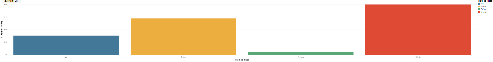

#### Análise

Foram registradas **1.718 ocorrências** na base analisada. A maior concentração está no grau de risco **Médio**, com 797 registros (46,39%), seguida pelo grau **Baixo**, com 576 ocorrências (33,53%).

Os eventos classificados como **Alto** representam 303 ocorrências (17,64%), enquanto os classificados como **Crítico** totalizam 42 registros (2,44%). Somados, os graus **Alto e Crítico correspondem a 345 ocorrências**, aproximadamente **20,08% do total da base**.

Os resultados mostram predominância dos graus Médio e Baixo, que juntos representam **79,92%** das ocorrências. Entretanto, a participação dos eventos Alto e Crítico reforça a importância de aprofundar as análises sobre os fatores associados às ocorrências de maior grau de risco.

### 6.2  Como as ocorrências evoluem ao longo dos anos e dos meses?

A avaliação temporal foi dividida em duas perspectivas:

- **6.2.1 Evolução anual**, permitindo observar o comportamento das ocorrências entre os diferentes anos;
- **6.2.2 Evolução mensal**, permitindo uma análise mais detalhada da variação das ocorrências ao longo dos meses.

### 6.2.1 Evolução anual das ocorrências

A evolução anual das ocorrências foi analisada a partir do agrupamento dos registros pelo campo `ano`, utilizando os dados disponíveis na camada Gold.

Foram considerados os **1.718 registros** da base. A distribuição anual encontrada foi:

| Ano | Quantidade de ocorrências |
|---|---:|
| 2020 | 48 |
| 2021 | 91 |
| 2022 | 164 |
| 2023 | 338 |
| 2024 | 485 |
| 2025 | 592 |

Os resultados mostram um crescimento contínuo da quantidade de ocorrências registradas ao longo do período analisado. O menor número de registros foi observado em **2020**, com **48 ocorrências**, enquanto **2025** apresentou o maior valor da série, com **592 ocorrências**.

Em termos de participação no total da base, **2025 representa aproximadamente 34,5% dos registros**, seguido por **2024, com cerca de 28,2%**, e **2023, com aproximadamente 19,7%**. Em conjunto, os anos de **2023, 2024 e 2025 concentram cerca de 82,4% das 1.718 ocorrências**.

Também se observa que o crescimento mais acentuado entre anos consecutivos ocorreu entre **2022 e 2023**, quando a quantidade de registros passou de **164 para 338 ocorrências**.

Entretanto, esse comportamento deve ser interpretado como uma característica da base de dados analisada. O aumento da quantidade de registros não permite concluir, isoladamente, que houve crescimento real do número de acidentes, uma vez que fatores como ampliação da cobertura dos registros, mudanças nos processos de notificação ou maior disponibilidade de dados nos anos mais recentes também podem influenciar essa distribuição.

O gráfico a seguir apresenta visualmente a evolução anual das ocorrências:

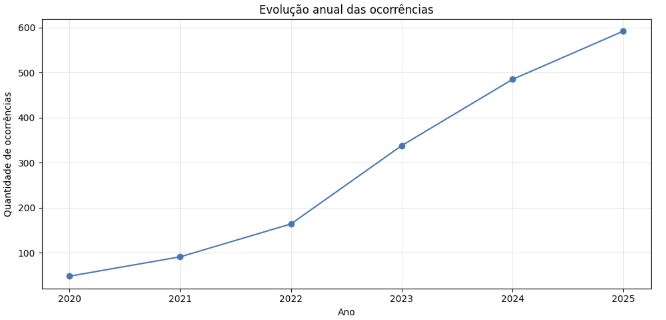

A análise anual fornece uma visão temporal geral do conjunto de dados e serve como referência para as análises seguintes, nas quais serão avaliados aspectos como gravidade, agentes causadores, segmentos, localização e outros fatores relacionados às ocorrências.

#### Análise dos resultados anuais

A evolução anual mostra crescimento contínuo dos registros de ocorrências ao longo do período analisado, passando de 48 registros em 2020 para 592 em 2025, maior valor da série. Os anos de 2023, 2024 e 2025 concentram aproximadamente 82,4% dos 1.718 registros, indicando maior concentração nos anos mais recentes.

O maior crescimento entre anos consecutivos ocorreu de 2022 para 2023, quando os registros passaram de 164 para 338 ocorrências.

Esse comportamento deve ser interpretado como uma característica da base analisada, pois o aumento dos registros não significa necessariamente aumento real dos acidentes, podendo também refletir diferenças na cobertura, no processo de notificação ou na disponibilidade de dados ao longo do período.

### 6.2.2 Evolução mensal das ocorrências

A análise mensal evidencia oscilações na quantidade de registros ao longo do período estudado, com maior concentração nos anos mais recentes.

O maior número mensal de registros foi observado em **outubro de 2025**, com **68 ocorrências**, enquanto o menor ocorreu em **novembro de 2020**, com **1 ocorrência**.

O gráfico mostra que, apesar das variações entre os meses, os maiores volumes estão concentrados principalmente nos períodos mais recentes, comportamento coerente com a tendência identificada na evolução anual.

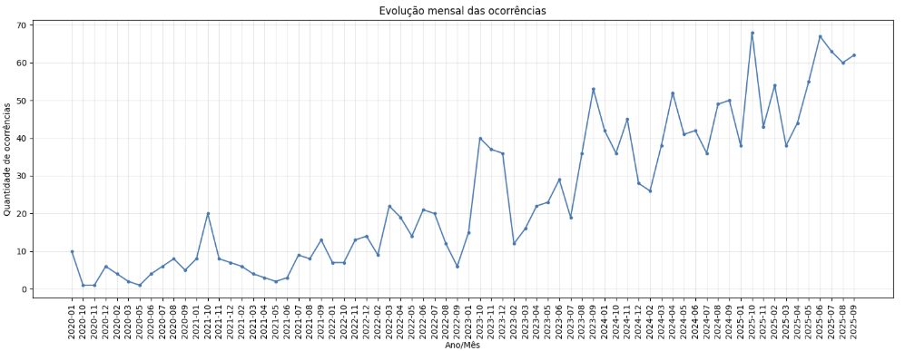

#### Análise dos resultados mensais

A análise mensal evidencia oscilações na quantidade de ocorrências registradas ao longo do período estudado, com maior concentração de registros nos anos mais recentes.

O gráfico mostra que, apesar das variações entre os meses, os volumes mensais se tornam mais elevados principalmente a partir de 2023, comportamento coerente com a tendência identificada na análise anual.

Esses resultados devem ser interpretados como características da base analisada. As diferenças observadas entre os meses não permitem concluir, isoladamente, que houve aumento ou redução real dos acidentes, pois fatores como cobertura dos registros, processo de notificação e disponibilidade histórica dos dados também podem influenciar essa distribuição.

### Síntese da análise temporal

As análises anual e mensal mostram aumento da quantidade de registros ao longo do período analisado, com maior concentração nos anos mais recentes.

Na visão anual, os registros passaram de **48 ocorrências em 2020** para **592 em 2025**, sendo que **2023, 2024 e 2025 concentram aproximadamente 82,4% dos 1.718 registros** da base. Na análise mensal, o maior volume foi observado em **outubro de 2025**, com **68 ocorrências**, enquanto o menor ocorreu em **novembro de 2020**, com **1 ocorrência**.

Em conjunto, os resultados indicam uma concentração crescente de registros ao longo do tempo. Entretanto, esse comportamento deve ser interpretado como uma característica da base analisada, não sendo suficiente, isoladamente, para concluir que houve aumento real dos acidentes, pois fatores relacionados à cobertura, notificação e disponibilidade dos dados também podem influenciar essa distribuição.

### 6.3  Quais agentes causadores apresentam maior número de eventos classificados com grau de risco Alto ou Crítico?

Para responder a esta pergunta, a análise foi dividida em três etapas complementares. Primeiro, é apresentada a distribuição dos eventos classificados como Alto ou Crítico por agente causador. Em seguida, é avaliada a participação dos principais agentes no conjunto desses eventos. Por fim, os resultados são interpretados de forma consolidada, destacando os agentes que mais se repetem entre as ocorrências de maior grau de risco.

- **6.3.1 Distribuição dos eventos Alto/Crítico por agente causador**
- **6.3.2 Participação dos principais agentes causadores nos eventos Alto/Crítico**
- **6.3.3 Análise dos resultados**

### 6.3.1 Distribuição dos eventos Alto/Crítico por agente causador

Para identificar quais agentes causadores aparecem com maior frequência entre os eventos classificados com grau de risco **Alto ou Crítico**, foram considerados apenas os registros pertencentes a essas duas categorias de risco.

Os agentes foram agrupados pela quantidade de eventos e ordenados do maior para o menor, considerando os dez com maior frequência.

| Agente causador | Quantidade de eventos |
|---|---:|
| D | 43 |
| Eletricidade | 40 |
| Carro - Colisão | 29 |
| Moto - Queda | 26 |
| Golpeado por (atingido por objeto em movimento) | 23 |
| Carro - Capotamento | 22 |
| Queda com diferença de nível | 16 |
| Moto - Colisão | 13 |
| Explosão | 9 |
| Atingido entre ou abaixo (esmagado ou amputado) | 7 |

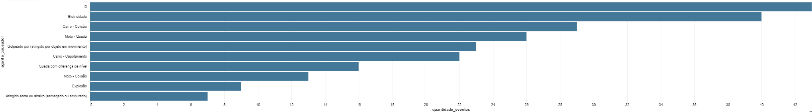

#### Análise dos resultados

Os resultados mostram que o código **“D”** apresentou a maior quantidade de eventos Alto/Crítico, com **43 ocorrências**. Conforme a nota explicativa da base de dados utilizada neste trabalho, entretanto, o código **“D”** corresponde a registros em que o agente causador não foi classificado durante o preenchimento, não representando, portanto, um agente causador específico.

Entre os agentes efetivamente identificados, **Eletricidade** apresentou a maior frequência, com **40 ocorrências**, seguida por **Carro - Colisão**, com **29**, e **Moto - Queda**, com **26 eventos**.

Também se destacaram **Golpeado por (atingido por objeto em movimento)**, com **23 ocorrências**, e **Carro - Capotamento**, com **22**.

Os resultados indicam que determinados agentes aparecem com maior recorrência entre os eventos classificados com maior grau de risco. No entanto, a análise representa uma associação por frequência e não permite, isoladamente, estabelecer relação direta de causa e efeito entre o agente causador e o grau de risco.

### 6.3.2 Participação dos principais agentes causadores nos eventos Alto/Crítico

Para complementar a análise anterior, foi calculada a participação percentual dos agentes causadores nos eventos classificados com grau de risco **Alto ou Crítico**.

Conforme a nota explicativa da base de dados, o código **“D”** representa registros cujo agente causador não foi classificado durante o preenchimento. Por esse motivo, esse código foi excluído desta análise, permitindo avaliar apenas os eventos com agente causador efetivamente identificado.

Foram considerados **241 eventos Alto/Crítico com agente causador classificado**.

| Agente causador | Quantidade de eventos | Participação (%) |
|---|---:|---:|
| Eletricidade | 40 | 16,60 |
| Carro - Colisão | 29 | 12,03 |
| Moto - Queda | 26 | 10,79 |
| Golpeado por (atingido por objeto em movimento) | 23 | 9,54 |
| Carro - Capotamento | 22 | 9,13 |
| Queda com diferença de nível | 16 | 6,64 |
| Moto - Colisão | 13 | 5,39 |
| Explosão | 9 | 3,73 |
| Atingido entre ou abaixo (esmagado ou amputado) | 7 | 2,90 |
| Animal | 6 | 2,49 |

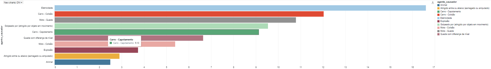

#### Análise dos resultados

Entre os agentes causadores efetivamente classificados, **Eletricidade** apresentou a maior participação nos eventos Alto/Crítico, com **40 ocorrências**, correspondendo a **16,60%** do total. Em seguida aparecem **Carro - Colisão**, com **12,03%**, e **Moto - Queda**, com **10,79%**.

Os cinco principais agentes causadores concentram aproximadamente **58,09%** dos eventos analisados. Considerando os dez agentes apresentados na tabela e no gráfico, essa participação alcança aproximadamente **79,24%** do total.

Os resultados indicam uma concentração relevante dos eventos de maior grau de risco em um conjunto relativamente reduzido de agentes causadores, com destaque para **Eletricidade** entre as categorias efetivamente identificadas.

A análise percentual complementa a frequência absoluta apresentada no item 6.3.1, permitindo avaliar a representatividade de cada agente causador no conjunto de eventos Alto/Crítico. Ressalta-se que os resultados representam frequência e associação, não permitindo, isoladamente, estabelecer relação direta de causa e efeito entre o agente causador e o grau de risco.

### 6.4 Características e combinações de fatores nos eventos de maior risco e acidentes fatais

**Pergunta do Negócio:** Quais características e combinações de fatores são mais frequentes nos eventos Alto/Crítico e nos acidentes fatais, considerando segmento, estado/local e agente causador?

Esta análise busca identificar os principais padrões presentes nos eventos classificados com grau de risco **Alto ou Crítico**, bem como nos **acidentes fatais**. Para isso, são considerados atributos como **segmento, estado/local e agente causador**, permitindo avaliar tanto as características mais frequentes de forma individual quanto as principais combinações entre esses fatores.

A análise está organizada nos seguintes subitens:

- **6.4.1 Principais características dos eventos Alto/Crítico**
- **6.4.2 Combinações de fatores mais frequentes**
- **6.4.3 Acidentes fatais**

### 6.4.1 Principais características dos eventos Alto/Crítico

Foram identificados **345 eventos classificados como Alto ou Crítico**. A distribuição por segmento mostra maior concentração na **Transmissão**, seguida por **Expansão**, **Geração - Hidráulica** e **CSC**.

| Segmento | Quantidade | Percentual |
|---|---:|---:|
| Transmissão | 153 | 44,35% |
| Expansão | 52 | 15,07% |
| Geração - Hidráulica | 45 | 13,04% |
| CSC | 43 | 12,46% |
| Adm | 26 | 7,54% |
| Expansão - Proj. Estr. | 10 | 2,90% |
| Geração - Térmica | 8 | 2,32% |
| Geração - Eólica | 3 | 0,87% |
| Logística | 2 | 0,58% |
| Telecomunicação | 2 | 0,58% |
| Geração | 1 | 0,29% |

A tabela evidencia que a **Transmissão concentra 44,35% dos eventos Alto/Crítico**, valor significativamente superior aos demais segmentos. Em seguida aparecem **Expansão, Geração - Hidráulica e CSC**, enquanto os demais segmentos apresentam participação menor.

#### Distribuição dos eventos Alto/Crítico por segmento

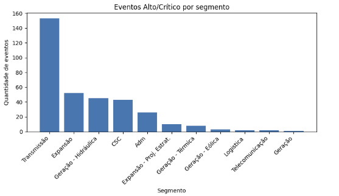

O gráfico reforça a predominância do segmento de **Transmissão**, que apresenta quantidade de eventos Alto/Crítico significativamente superior aos demais segmentos analisados.

#### Distribuição dos eventos Alto/Crítico por estado

A distribuição geográfica dos **345 eventos classificados como Alto ou Crítico** mostra que a maior concentração ocorre na **Bahia (BA)**, com **56 registros (16,23%)**. Na sequência aparecem **Rio Grande do Sul (RS)**, **Pernambuco (PE)**, **Rio de Janeiro (RJ)** e **São Paulo (SP)**.

Para facilitar a visualização, a tabela apresenta os **10 estados com maior número de eventos Alto/Crítico**.

| Estado | Quantidade | Percentual |
|---|---:|---:|
| BA | 56 | 16,23% |
| RS | 34 | 9,86% |
| PE | 30 | 8,70% |
| RJ | 27 | 7,83% |
| SP | 24 | 6,96% |
| SC | 19 | 5,51% |
| RO | 18 | 5,22% |
| MA | 18 | 5,22% |
| PA | 18 | 5,22% |
| MG | 15 | 4,35% |

Os resultados mostram maior concentração dos eventos Alto/Crítico na **Bahia**, embora os registros estejam distribuídos por diferentes estados, indicando uma dispersão geográfica relevante das ocorrências de maior grau de risco.

#### Distribuição dos eventos Alto/Crítico por local

A análise por local mostra maior concentração dos **345 eventos classificados como Alto ou Crítico** nas categorias **Empresa** e **Via pública**, que juntas representam mais de 80% dos registros analisados.

| Local | Quantidade | Percentual |
|---|---:|---:|
| Empresa | 161 | 46,67% |
| Via pública | 126 | 36,52% |
| Área rural | 47 | 13,62% |
| Não informado | 6 | 1,74% |
| SPE | 3 | 0,87% |
| Área urbana | 2 | 0,58% |

Os resultados mostram que **Empresa** é o local mais frequente, com **161 ocorrências (46,67%)**, seguido por **Via pública**, com **126 registros (36,52%)**. A categoria **Área rural** aparece em terceiro lugar, com **47 eventos (13,62%)**, enquanto os demais locais apresentam participação reduzida.
Nota: Para efeito de melhor entendimento, as respostas "null" foram substituídas por "Não informado". 

#### Distribuição dos eventos Alto/Crítico por agente causador

A análise dos agentes causadores permite identificar os fatores mais frequentes entre os **345 eventos classificados como Alto ou Crítico**. Observa-se também uma quantidade relevante de registros sem informação ou classificados como **“D”**, aspecto que deve ser considerado na interpretação dos resultados.

| Agente causador | Quantidade | Percentual |
|---|---:|---:|
| Não informado | 57 | 16,52% |
| D | 43 | 12,46% |
| Eletricidade | 40 | 11,59% |
| Carro - Colisão | 29 | 8,41% |
| Moto - Queda | 26 | 7,54% |
| Golpeado por (atingido por objeto em movimento) | 23 | 6,67% |
| Carro - Capotamento | 22 | 6,38% |
| Queda com diferença de nível | 16 | 4,64% |
| Moto - Colisão | 13 | 3,77% |
| Explosão | 9 | 2,61% |
| Atingido entre ou abaixo (esmagado ou amputado) | 7 | 2,03% |
| Veículo rodoviário motorizado | 6 | 1,74% |
| Ferramenta Manual | 6 | 1,74% |
| Queimadura | 6 | 1,74% |
| Animal | 6 | 1,74% |

#### Principais agentes causadores dos eventos Alto/Crítico

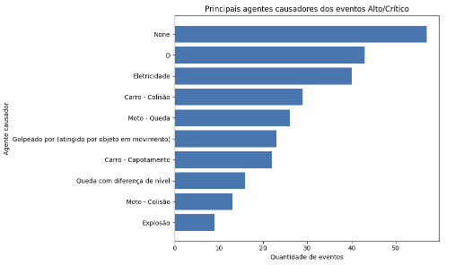

Entre os agentes claramente identificados, **Eletricidade** apresenta a maior frequência, com **40 eventos (11,59%)**, seguida por ocorrências relacionadas a colisões, quedas e capotamentos de veículos.

Destaca-se, entretanto, a presença de **57 registros não informados (16,52%)** e **43 registros classificados como “D” (12,46%)**. A categoria **“D” foi mantida conforme registrada na base original, por não haver informação suficiente para associá-la a um agente causador específico**. Por esse motivo, tanto os registros não informados quanto a categoria “D” devem ser considerados uma limitação de qualidade dos dados e interpretados com cautela.

### 6.4.2 Combinações de fatores mais frequentes

Após a análise individual das principais características dos eventos Alto/Crítico, foram avaliadas combinações entre **segmento, estado/local e agente causador**, buscando identificar padrões recorrentes entre os fatores analisados.

#### Combinação: Segmento × Estado

O cruzamento entre **segmento e estado** mostra forte presença do segmento de **Transmissão** entre as combinações mais frequentes. A maior concentração ocorre em **Transmissão | BA**, com 18 eventos, seguida por **Transmissão | SP**, com 15 registros.

| Segmento | Estado | Quantidade | Percentual |
|---|:---:|---:|---:|
| Transmissão | BA | 18 | 5,22% |
| Transmissão | SP | 15 | 4,35% |
| Transmissão | PE | 14 | 4,06% |
| Transmissão | RJ | 14 | 4,06% |
| Geração - Hidráulica | BA | 12 | 3,48% |
| Transmissão | RO | 11 | 3,19% |
| Transmissão | SC | 11 | 3,19% |
| Transmissão | RS | 11 | 3,19% |
| Expansão | BA | 9 | 2,61% |
| Expansão | RS | 9 | 2,61% |

#### Principais combinações: Segmento × Estado

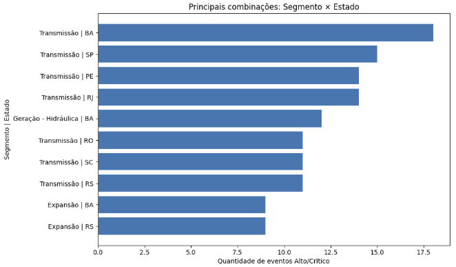

O gráfico evidencia a predominância da **Transmissão** entre as principais combinações de segmento e estado. A **Bahia** também se destaca, aparecendo tanto associada à Transmissão quanto à Geração - Hidráulica e Expansão. Esses resultados indicam as combinações mais frequentes na base, não representando, isoladamente, uma medida de risco relativo.

#### Combinação: Segmento × Local

O cruzamento entre **segmento e local** mostra que as combinações mais frequentes estão fortemente concentradas no segmento de **Transmissão**. Destacam-se **Transmissão | Empresa**, com **59 eventos (17,10%)**, **Transmissão | Via pública**, com **54 (15,65%)**, e **Transmissão | Área rural**, com **37 (10,72%)**.

| Segmento | Local | Quantidade | Percentual |
|---|---|---:|---:|
| Transmissão | Empresa | 59 | 17,10% |
| Transmissão | Via pública | 54 | 15,65% |
| Transmissão | Área rural | 37 | 10,72% |
| Expansão | Empresa | 28 | 8,12% |
| Geração - Hidráulica | Empresa | 26 | 7,54% |
| CSC | Via pública | 21 | 6,09% |
| CSC | Empresa | 19 | 5,51% |
| Expansão | Via pública | 16 | 4,64% |
| Geração - Hidráulica | Via pública | 16 | 4,64% |
| Adm | Via pública | 14 | 4,06% |

#### Principais combinações: Segmento × Local

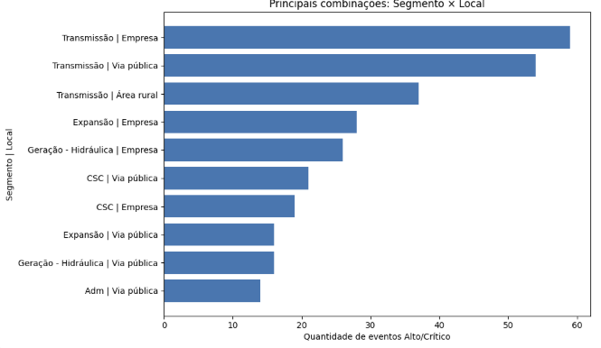

O gráfico reforça a predominância da **Transmissão** entre as principais combinações, especialmente nos locais **Empresa**, **Via pública** e **Área rural**. Também aparecem com destaque combinações envolvendo **Expansão**, **Geração - Hidráulica** e **CSC**.

Esses resultados indicam os contextos mais frequentes observados na base, sem representar, isoladamente, uma medida de risco relativo.

#### Combinação: Segmento × Agente causador

O cruzamento entre **segmento e agente causador** mostra novamente forte presença do segmento de **Transmissão** entre as combinações mais frequentes. Destacam-se **Transmissão | Não informado**, com **32 eventos (9,28%)**, **Transmissão | Eletricidade**, com **27 (7,83%)**, e **Transmissão | Carro - Capotamento**, com **19 (5,51%)**.

| Segmento | Agente causador | Quantidade | Percentual |
|---|---|---:|---:|
| Transmissão | Não informado | 32 | 9,28% |
| Transmissão | Eletricidade | 27 | 7,83% |
| Transmissão | Carro - Capotamento | 19 | 5,51% |
| CSC | Não informado | 14 | 4,06% |
| Transmissão | D | 13 | 3,77% |
| Transmissão | Golpeado por (atingido por objeto em movimento) | 12 | 3,48% |
| Expansão | D | 11 | 3,19% |
| Geração - Hidráulica | D | 9 | 2,61% |
| Transmissão | Moto - Queda | 8 | 2,32% |
| Expansão | Carro - Colisão | 8 | 2,32% |

#### Principais combinações: Segmento × Agente causador

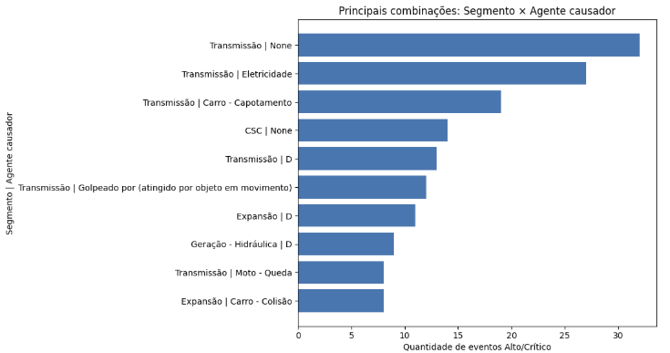

O gráfico evidencia a predominância da **Transmissão** entre as principais combinações. Entre os agentes claramente identificados, destacam-se **Eletricidade**, **Carro - Capotamento**, **Golpeado por objeto em movimento** e **Moto - Queda**.

Também aparecem com frequência registros **não informados** e a categoria **“D”**. Conforme já identificado anteriormente, a categoria “D” foi mantida conforme registrada na base original, por não haver informação suficiente para associá-la a um agente causador específico. Esses registros devem ser considerados uma limitação de qualidade dos dados na interpretação dos resultados.

#### Combinação: Estado × Agente causador

O cruzamento entre **estado e agente causador** apresenta maior dispersão das combinações em comparação com os cruzamentos anteriores. A associação mais frequente é **BA | D**, com **16 eventos**, seguida por combinações envolvendo acidentes com veículos, eletricidade e registros não informados em diferentes estados.

| Estado | Agente causador | Quantidade | Percentual |
|---|---|---:|---:|
| BA | D | 16 | 4,64% |
| PE | Carro - Capotamento | 7 | 2,03% |
| MA | Não informado | 7 | 2,03% |
| BA | Carro - Colisão | 7 | 2,03% |
| SP | Não informado | 7 | 2,03% |
| RS | Não informado | 6 | 1,74% |
| BA | Eletricidade | 6 | 1,74% |
| PE | Eletricidade | 6 | 1,74% |
| RJ | Carro - Capotamento | 6 | 1,74% |
| MG | Não informado | 6 | 1,74% |

#### Principais combinações: Estado × Agente causador

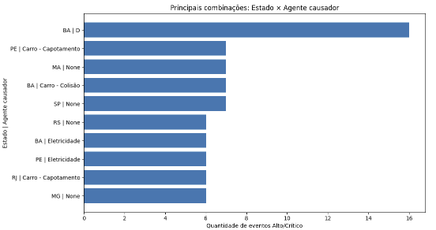

O gráfico mostra que a combinação **BA | D** apresenta a maior frequência entre os cruzamentos analisados. Também aparecem com destaque ocorrências relacionadas a **capotamentos, colisões e eletricidade**, distribuídas entre diferentes estados.

A presença de registros **não informados** e da categoria **“D”**, mantida conforme registrada na base original, deve ser considerada como limitação de qualidade dos dados. De forma geral, esse cruzamento mostra uma distribuição mais dispersa, sem uma única associação dominante entre estado e agente causador, além da combinação observada na Bahia.

#### Análise dos resultados

A análise das combinações dos 345 eventos Alto/Crítico reforça a predominância do segmento de Transmissão, especialmente nas associações com determinados estados e com os locais Empresa e Via pública. Também aparecem com frequência combinações envolvendo Eletricidade e acidentes com veículos.
O cruzamento entre estado e agente causador apresenta maior dispersão, com destaque para BA | D. A presença de registros não informados e da categoria “D” limita parte da interpretação e deve ser considerada como aspecto de qualidade dos dados.
De forma geral, os resultados mostram padrões recorrentes entre segmento, localização e agente causador, mas representam apenas frequências observadas na base e não devem ser interpretados como medida direta de risco relativo.

### 6.4.3 Acidentes fatais

Neste subitem são analisados os registros classificados como **Fatalidade** ou **Fatalidade Trajeto** na coluna `classificacao`. O objetivo é identificar as principais características dos acidentes fatais presentes na base e complementar as análises anteriores dos eventos Alto/Crítico.

Foram identificados **15 acidentes fatais**, sendo **9 classificados como Fatalidade (60%)** e **6 como Fatalidade Trajeto (40%)**.

| Classificação | Quantidade | Percentual |
|---|---:|---:|
| Fatalidade | 9 | 60,00% |
| Fatalidade Trajeto | 6 | 40,00% |

A distribuição mostra predominância dos registros classificados como **Fatalidade**, embora os acidentes de **Fatalidade Trajeto** também representem uma parcela relevante do total de casos fatais analisados.

#### Distribuição dos acidentes fatais por segmento

A análise por segmento mostra que os **15 acidentes fatais** estão concentrados principalmente em **Transmissão** e **CSC**.

| Segmento | Quantidade | Percentual |
|---|---:|---:|
| Transmissão | 8 | 53,33% |
| CSC | 5 | 33,33% |
| Expansão | 1 | 6,67% |
| Adm | 1 | 6,67% |

#### Acidentes fatais por segmento

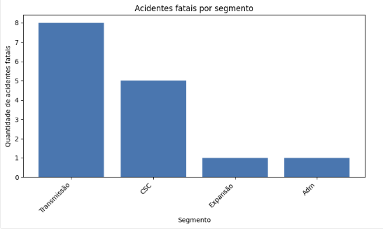

O gráfico evidencia a predominância do segmento de **Transmissão**, com **8 acidentes fatais (53,33%)**, seguido pelo **CSC**, com **5 registros (33,33%)**. Expansão e Adm apresentam **1 ocorrência cada (6,67%)**.

#### Distribuição dos acidentes fatais por estado

Os **15 acidentes fatais** estão distribuídos entre oito estados. **RN** e **PE** apresentam as maiores quantidades, com **3 registros cada (20,00%)**. Em seguida aparecem **PB, GO e PA**, com **2 ocorrências cada (13,33%)**.

| Estado | Quantidade | Percentual |
|---|---:|---:|
| RN | 3 | 20,00% |
| PE | 3 | 20,00% |
| PB | 2 | 13,33% |
| GO | 2 | 13,33% |
| PA | 2 | 13,33% |
| PR | 1 | 6,67% |
| BA | 1 | 6,67% |
| SE | 1 | 6,67% |

#### Estados com maior número de acidentes fatais

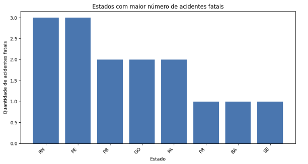

O gráfico mostra uma distribuição relativamente dispersa dos acidentes fatais entre os estados, com destaque para **RN** e **PE**, que concentram os maiores números de registros.

#### Distribuição dos acidentes fatais por local

A análise dos **15 acidentes fatais** mostra maior concentração em **Via pública**, com **9 registros (60,00%)**. Em seguida aparecem **Empresa**, com **4 ocorrências (26,67%)**, e **Área rural**, com **2 registros (13,33%)**.

| Local | Quantidade | Percentual |
|---|---:|---:|
| Via pública | 9 | 60,00% |
| Empresa | 4 | 26,67% |
| Área rural | 2 | 13,33% |

#### Principais locais dos acidentes fatais

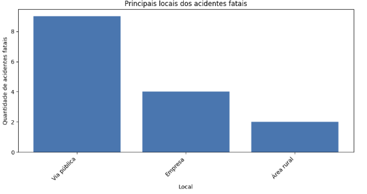

O gráfico evidencia a predominância de acidentes fatais em **Via pública**, que concentra mais da metade dos registros analisados. Os demais casos estão distribuídos entre **Empresa** e **Área rural**.

#### Distribuição dos acidentes fatais por agente causador

A análise dos **15 acidentes fatais** mostra maior frequência para **Queda com diferença de nível** e para a categoria **“D - categoria não detalhada”**, ambas com **4 registros (26,67%)**. Em seguida aparecem **Eletricidade** e **Não informado**, com **2 ocorrências cada (13,33%)**.

| Agente causador | Quantidade | Percentual |
|---|---:|---:|
| Queda com diferença de nível | 4 | 26,67% |
| D - categoria não detalhada | 4 | 26,67% |
| Eletricidade | 2 | 13,33% |
| Não informado | 2 | 13,33% |
| Carro - Colisão | 1 | 6,67% |
| Moto - Queda | 1 | 6,67% |
| Carro - Capotamento | 1 | 6,67% |

#### Principais agentes causadores dos acidentes fatais

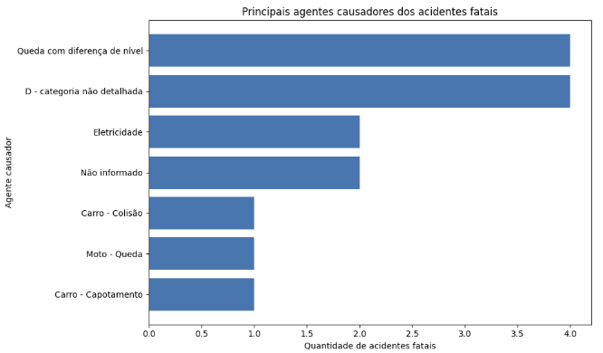

O gráfico mostra que **Queda com diferença de nível** é o agente causador claramente identificado com maior frequência entre os acidentes fatais. A categoria **“D”** também apresenta 4 registros, mas foi mantida como **categoria não detalhada**, pois não há informação suficiente na base para associá-la a um agente causador específico.

Também aparecem registros relacionados à **Eletricidade** e a acidentes com veículos. A presença de casos **não informados** e da categoria “D” deve ser considerada como uma limitação de qualidade dos dados na interpretação dos resultados.

#### Análise 6.4.3

Foram identificados **15 acidentes fatais**, sendo **9 classificados como Fatalidade (60%)** e **6 como Fatalidade Trajeto (40%)**. Em relação ao segmento, destaca-se a **Transmissão**, com **8 registros (53,33%)**, seguida pelo **CSC**, com 5 ocorrências.

A distribuição por estado apresenta maior dispersão, enquanto, quanto ao local, destaca-se **Via pública**, com **9 registros (60%)**, seguida por **Empresa**, com 4, e **Área rural**, com 2.

Entre os agentes causadores, **Queda com diferença de nível** apresenta a maior frequência entre os agentes claramente identificados, com **4 registros (26,67%)**. A categoria **“D - categoria não detalhada”** também possui 4 registros, além de **Eletricidade** e **Não informado**, com 2 ocorrências cada.

De forma geral, os acidentes fatais apresentam maior concentração no segmento de **Transmissão** e em **Via pública**. A presença da categoria “D” e de valores não informados deve ser considerada como uma limitação de qualidade dos dados.

## 6.5 Síntese das respostas às perguntas de negócio

A análise das características e combinações de fatores dos **345 eventos classificados como Alto ou Crítico** mostrou maior concentração no segmento de **Transmissão**, especialmente em determinados estados e nos locais **Empresa** e **Via pública**.

Nos cruzamentos entre variáveis, a Transmissão permaneceu entre as combinações mais frequentes, principalmente nas associações com estado, local e agente causador. Entre os agentes identificados, destacam-se **Eletricidade** e ocorrências relacionadas a veículos, embora a presença de registros não informados e da categoria **“D”** limite parte da interpretação.

Na análise específica dos **15 acidentes fatais**, houve predominância da classificação **Fatalidade**, com 9 registros, frente a 6 de **Fatalidade Trajeto**. Também se destacaram o segmento de **Transmissão**, as ocorrências em **Via pública** e, entre os agentes claramente identificados, **Queda com diferença de nível**.

De forma geral, o item 6.4 evidencia padrões recorrentes relacionados a **segmento, localização e agente causador**, contribuindo para a caracterização dos eventos de maior severidade presentes na base. Os resultados representam frequências observadas e devem ser interpretados considerando as limitações de qualidade dos dados e a ausência de medidas de exposição que permitam comparar diretamente o risco relativo entre segmentos ou localidades.

## 7. Autoavaliação

O desenvolvimento deste MVP permitiu atingir o objetivo proposto de organizar e analisar registros de segurança do setor elétrico, buscando identificar padrões relacionados principalmente às ocorrências de maior risco e aos acidentes fatais.

A utilização do Databricks e da arquitetura medalhão contribuiu para organizar o processo de forma estruturada, desde a entrada dos dados na camada Bronze, passando pelo tratamento e padronização na Silver, até a disponibilização da base preparada para análise na camada Gold. Durante esse processo, também foi possível avaliar a qualidade dos dados e identificar valores nulos, diferenças de preenchimento e inconsistências em alguns campos categóricos, aspectos que precisam ser considerados na interpretação dos resultados.

De forma geral, a base permitiu responder às perguntas de negócio definidas no início do trabalho e realizar análises sobre a evolução das ocorrências ao longo do tempo, grau de risco, agentes causadores, características dos eventos Alto/Crítico e acidentes fatais.

Para este MVP, foi adotado um modelo de dados em tabela flat na camada Gold, principalmente pela simplicidade de implementação e pelo tempo disponível para o desenvolvimento. Esse modelo mostrou-se suficiente para as análises propostas. Como evolução do projeto, poderá ser adotado um modelo dimensional em esquema estrela, com uma tabela fato de ocorrências e dimensões como tempo, localidade, segmento, agente causador e classificação do acidente.

Essa evolução poderá melhorar a organização e a reutilização dos dados, facilitar análises mais detalhadas e ampliar a capacidade de comparação entre diferentes características das ocorrências.

Como próximos passos, também podem ser considerados o aprimoramento da padronização dos dados, o tratamento mais completo dos registros incompletos, a ampliação da série histórica e o desenvolvimento de indicadores e dashboards para acompanhamento dos eventos de maior risco. Dessa forma, o projeto poderá evoluir de uma análise exploratória para uma solução mais estruturada de apoio à gestão da segurança.
